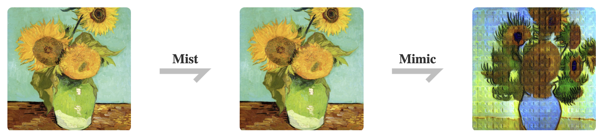

<p align="center">
<br>
<!--  -->

<br>
</p>


[](https://mist-project.github.io/index_en.html)
[](https://arxiv.org/abs/2310.04687)
<!-- 
[](https://arxiv.org/abs/2310.04687)
-->
<!-- 
### [project page](https://mist-project.github.io) | [arxiv](https://arxiv.org/abs/2310.04687) | [document](https://arxiv.org/abs/2310.04687) -->

<!-- #region -->
<!-- <p align="center">

</p> -->
<!-- #endregion -->
<!-- 
> Mist adds watermarks to images, making them unrecognizable and unusable for AI-for-Art models that try to mimic them. -->

<!-- #region -->
<p align="center">

</p>
<!-- <p align="center">

</p> -->
<!-- #endregion -->

> Mist's Effects in User Cases. **The first row:** Lora generation from source images.
**The second row:** Lora generation from Mist-treated samples. Mist V2 significantly disrupts the output of the generation, effectively protecting artists' images. Used images are from anonymous artists. All rights reserved. 
<!-- #region -->
<!-- <p align="center">

</p> -->
<!-- #endregion -->

<!-- > Robustness of Mist against image preprocessing. -->

<!-- ## News

**2022/12/11**: Mist V2 released.  -->

## Main Features
- Enhanced protection against AI-for-Art applications like Lora and SDEdit
- Imperceptible noise.
- 3-5 minutes processing with only 6GB of GPU memory in most cases. CPU processing supported.
- Resilience against denoising methods.


## About Mist
Mist is a powerful image preprocessing tool designed for the purpose of protecting the style and content of
images from being mimicked by state-of-the-art AI-for-Art applications. By adding watermarks to the images, Mist renders them unrecognizable and inmitable for the
models employed by AI-for-Art applications. Attempts by AI-for-Art applications to mimic these Misted images
will be ineffective, and the output image of such mimicry will be scrambled and unusable as artwork.


<p align="center">

</p>

In Mist V2, we have enhanced its effectiveness against a wider range of AI-for-Art applications, particularly excelling with Lora. Mist V2 achieves robust defense with even more discreet watermarks compared to [Mist V1](https://github.com/mist-project/mist). Additionally, Mist V2 introduces support for CPU processing and can efficiently run on GPUs with as little as 6GB of memory in most cases.


 <!-- For more details, refer to our [documentation](https://arxiv.org/abs/2310.04687). -->


## Quick Start

### Environment

**Preliminaries:** To run this repository, please have [Anaconda](https://pytorch.org/) installed in your work station. The GPU version of Mist requires a NVIDIA GPU in [Ampere](https://en.wikipedia.org/wiki/Ampere_(microarchitecture)) or more advanced architecture with more than 6GB VRAM. You can also try the CPU version 
in a moderate running speed.

Clone this repository to your local and get into the repository root:

```bash
git clone https://github.com/mist-project/mist-v2.git
cd mist-v2
```

Then, run the following commands in the root of the repository to install the environment:

```bash
conda create -n mist-v2 python=3.10
conda activate mist-v2
pip install -r requirements.txt
```

### Usage

Run Mist V2 in the default setup on GPU:
```bash
accelerate launch attacks/mist.py --cuda --low_vram_mode --instance_data_dir $INSTANCE_DIR --output_dir $OUTPUT_DIR --class_data_dir $CLASS_DATA_DIR --instance_prompt $PROMPT --class_prompt $CLASS_PROMPT --mixed_precision bf16
```

Run Mist V2 in the default setup on CPU:
```bash
accelerate launch attacks/mist.py --instance_data_dir $INSTANCE_DIR --output_dir $OUTPUT_DIR --class_data_dir $CLASS_DATA_DIR --instance_prompt $PROMPT --class_prompt $CLASS_PROMPT --mixed_precision bf16
```

The parameters are demonstrated in the following table:

| Parameter       | Explanation                                                                                |
| --------------- | ------------------------------------------------------------------------------------------ |
| $INSTANCE_DIR   | Directory of  input clean images. The goal is to add adversarial noise to them.            |
| $OUTPUT_DIR     | Directory for output adversarial examples (misted images).                                 |
| $CLASS_DATA_DIR | Directory  for class data in prior preserved training of Dreambooth, required to be empty. |
| $PROMPT         | Prompt that describes the input clean images, used to perturb the images.                  |
| $CLASS_PROMPT   | Prompt used to generate class data, recommended to be similar to $PROMPT.                  |

Here is a case command to run Mist V2 on GPU:

```bash
accelerate launch attacks/mist.py --cuda --low_vram_mode --instance_data_dir data/training --output_dir output/ --class_data_dir data/class --instance_prompt "a photo of a misted person, high quality, masterpiece" --class_prompt "a photo of a person, high quality, masterpiece" --mixed_precision bf16
```

We also provide a WebUI with the help of [Gradio](https://www.gradio.app/). To boost the WebUI, run:

```bash
python mist-webui.py
```

### Evaluation

We provide a simple pipeline to evaluate the output adversarial examples (only for GPU users). 
Basically, this pipeline trains a LoRA on the adversarial examples and samples images with the LoRA. 
Note that our adversarial examples may induce LoRA to output images with NSFW contents 
(for example, chaotic texture). As stated, this is to prevent LoRA training on unauthorized image data. To evaluate the effectiveness of our method, we disable the safety checker in the LoRA sampling script. Following is the instruction to run the pipeline.

First, train a LoRA on the output adversarial examples. 

```bash
accelerate launch eval/train_dreambooth_lora_15.py --instance_data_dir=$LORA_INPUT_DIR --output_dir=$LORA_OUTPUT_DIR --class_data_dir=$LORA_CLASS_DIR --instance_prompt $LORA_PROMPT --class_prompt $LORA_CLASS_PROMPT --resolution=512 --train_batch_size=1 --learning_rate=1e-4 --scale_lr --max_train_steps=2000
```

The parameters are demonstrated in the following table:
  

| Parameter          | Explanation                                                                                                |
| ------------------ | ---------------------------------------------------------------------------------------------------------- |
| $LORA_INPUT_DIR    | Directory of  training data (adversarial examples), staying the same as $OUTPUT_DIR in the previous table. |
| $LORA_OUTPUT_DIR   | Directory to store the trained LoRA.                                                                       |
| $LORA_CLASS_DIR    | Directory  for class data in prior preserved training of Dreambooth, required to be empty.                 |
| $LORA_PROMPT       | Prompt that describes the training data, used to train the LoRA.                                           |
| $LORA_CLASS_PROMPT | Prompt used to generate class data, recommended to be related to $LORA_PROMPT.                             |


Next, open the `eval/sample_lora_15.ipynb` and run the first block. After that, change the value of the variable `LORA_OUTPUT_DIR` to be the previous `$LORA_OUTPUT_DIR` when training the LoRA. 

```Python
from lora_diffusion import tune_lora_scale, patch_pipe
torch.manual_seed(time.time())

# The directory of LoRA
LORA_OUTPUT_DIR = [The value of $LORA_OUTPUT_DIR]
...
```

Finally, run the second block to see the output and evaluate the performance of Mist.


## A Glimpse to Methodology

Mist V2 works by adversarially attacking generative diffusion models. Basically, the attacking is an optimization over the following objective:

$$ \underset{x'}{min} \mathbb{E} {(z_0', \epsilon,t)}  \Vert \epsilon_\theta(z'_t(z'_0,\epsilon),t)-z_0^T\Vert^2_2, \Vert x'-x\Vert\leq\zeta$$

We demonstrate the notation in the following table.

| Variable          | Explanation                                                      |
| ----------------- | ---------------------------------------------------------------- |
| $x$ / $x'$        | The clean image / The adversarial example                        |
| $t$               | Time step in the diffusion model.                                |
| $z'_0$            | The latent variable of $x'$ in the 0th time step                 |
| $\epsilon$        | A standard Gaussian noise                                        |
| $z_0^T$           | The latent variable of a target image $x^T$ in the 0th time step |
| $\epsilon_\theta$ | The noise predictor (U-Net) in the diffusion model               |
| $\zeta$           | The budget of adversarial noise                                  |


Intuitively, we find that pushing the output of the U-Net in the diffusion model to the 0th timestep 
latent variable of a target image can effectively confuse the diffusion model. This abstracts the 
aforementioned objective of Mist V2.

Our paper is still in working. We are trying to reveal the mechanism behind our method in the paper. Despite of this, you can access [Arxiv]() to view the first draft of our paper.

## License

This project is licensed under the [GPL-3.0 license](https://github.com/mist-project/mist/blob/main/LICENSE). 

 
## Citation
If you find our work valuable and utilize it, we kindly request that you cite our paper.

```
@article{zheng2023understanding,
  title={Understanding and Improving Adversarial Attacks on Latent Diffusion Model},
  author={Zheng, Boyang and Liang, Chumeng and Wu, Xiaoyu and Liu, Yan},
  journal={arXiv preprint arXiv:2310.04687},
  year={2023}
}
```

Our repository also refers to following papers:

```
@inproceedings{van2023anti,
  title={Anti-DreamBooth: Protecting users from personalized text-to-image synthesis},
  author={Van Le, Thanh and Phung, Hao and Nguyen, Thuan Hoang and Dao, Quan and Tran, Ngoc N and Tran, Anh},
  booktitle={Proceedings of the IEEE/CVF International Conference on Computer Vision},
  pages={2116--2127},
  year={2023}
}
```

```
@article{liang2023mist,
  title={Mist: Towards Improved Adversarial Examples for Diffusion Models},
  author={Liang, Chumeng and Wu, Xiaoyu},
  journal={arXiv preprint arXiv:2305.12683},
  year={2023}
}
```


