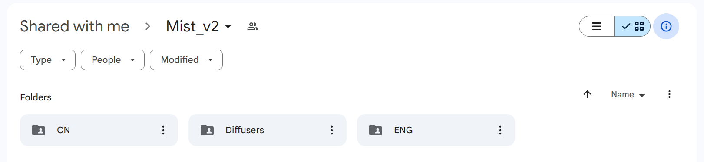
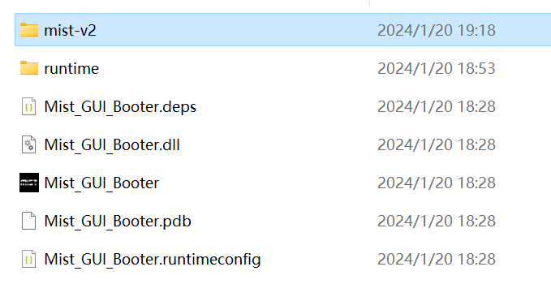
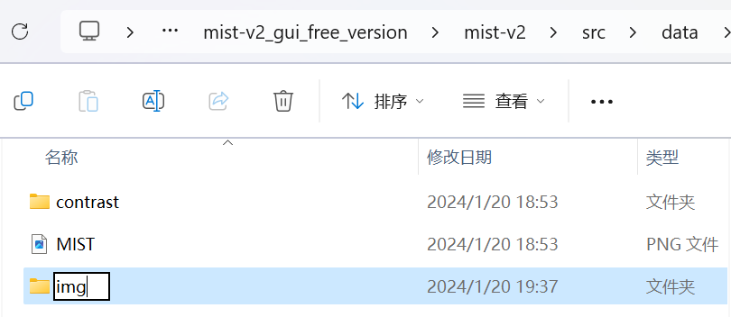
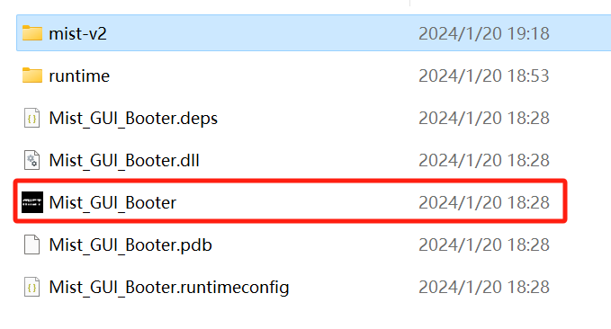
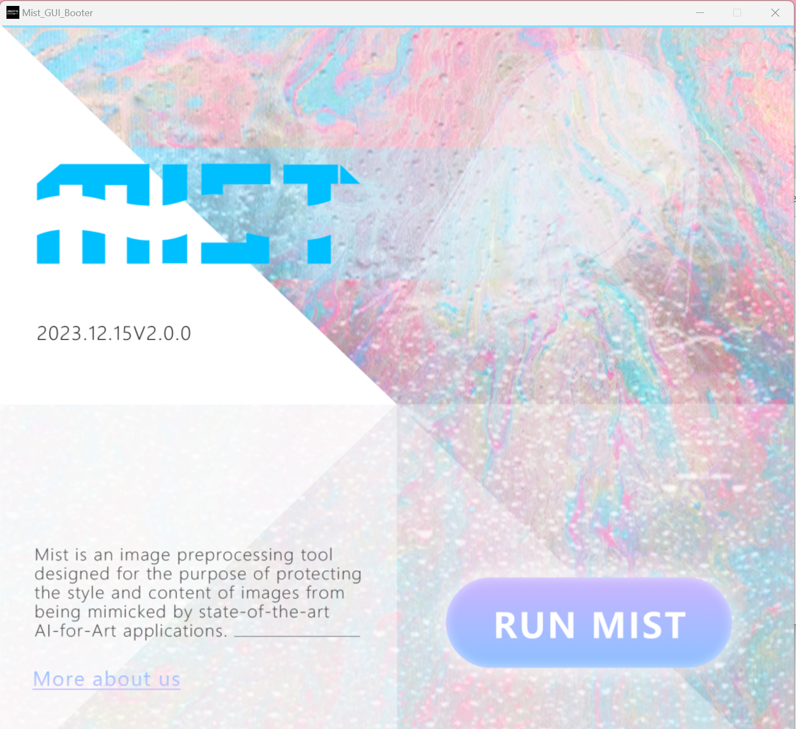
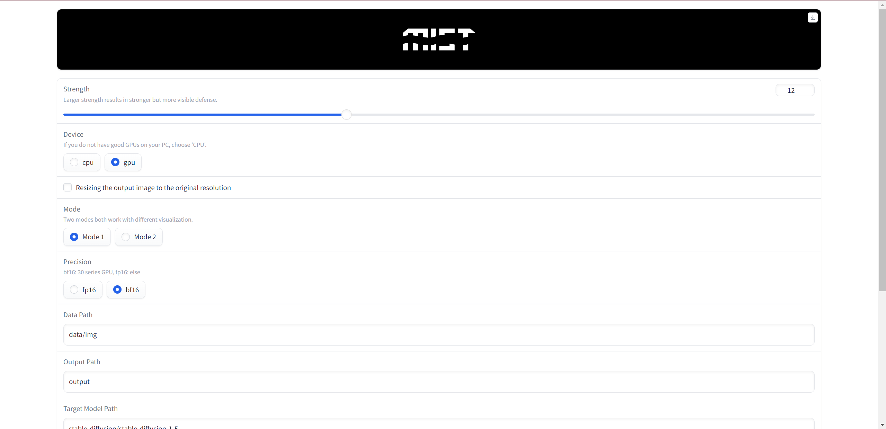
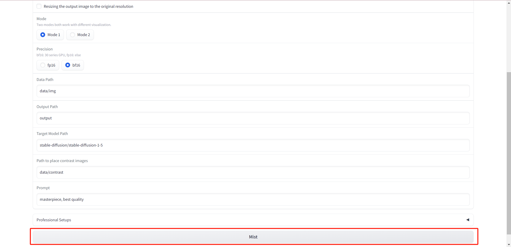
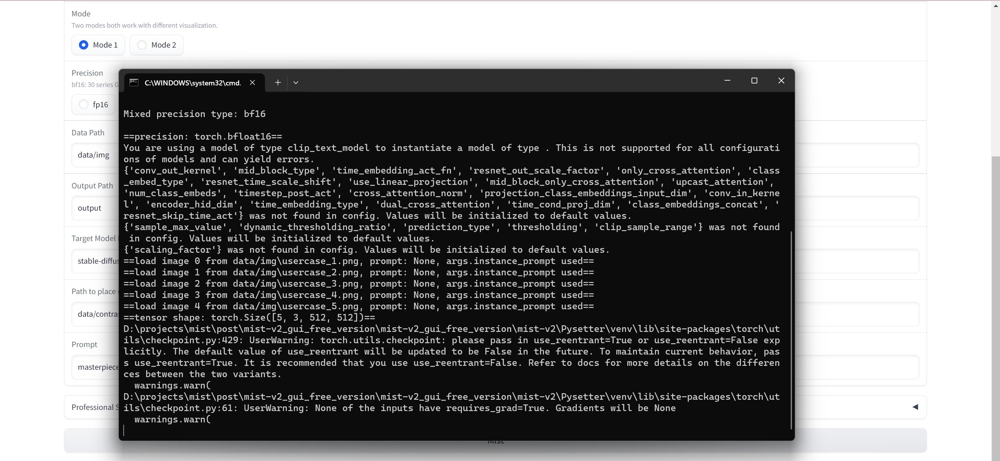
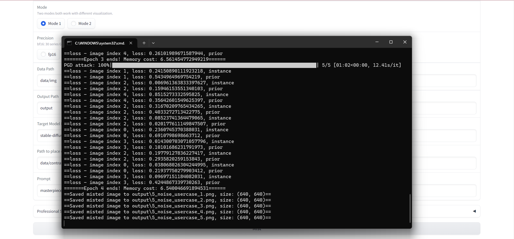
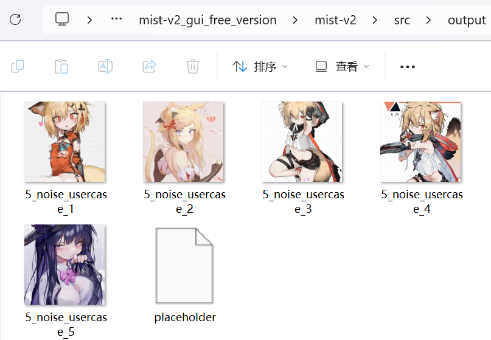

 
<!--  -->

 

# Handbook: Mist-v2 Free Version

Mist-v2 free version allows you to have Mist-v2 deployed at your local devices without connecting to the network. This instruction focuses
on how to deploy and run Mist-v2 free version.

## Download

Download and install the following Windows official kit: [.NET](https://dotnet.microsoft.com/zh-cn/download/dotnet/thank-you/runtime-desktop-7.0.13-windows-x64-installer).

Access our [Google Drive](https://drive.google.com/drive/folders/1vg8oK2BUOla5adaJcFYx5QMq0-MoP8kk?usp=drive_link).

Download the file *mist-v2_gui_free_version* .

Unzip the file to see the following file structure.

## Run

**Note: This step does not require network connection.**

Create a folder called `img` in `mist-v2_gui_free_version/mist-v2/src/data/` and put your to-be-Misted images in the folder.

Click on `Mist_GUI_Booter`. 

Click *Run Mist* in the booter.

See the GUI of Mist-v2. 

Click on `Mist` to Mist your images.

If Mist-v2 is currently running, you can see the following messages in the command window:

After seeing the following messages, the output will be placed in the `mist-v2_gui_free_version/mist-v2/src/output/`.

Open `mist-v2_gui_free_version/mist-v2/src/output/` to check the output images.

## Hints

**Device requirements**：Windows system and an Nvidia GPU with at least 6 GB VRAM. 

**How to pick image batch for one shot of running Mist**：Select 10-20 images with similar contents or styles. 

**Running time**：3 minutes for one image on average. Note that it is not recommended to Mist one image separately.

